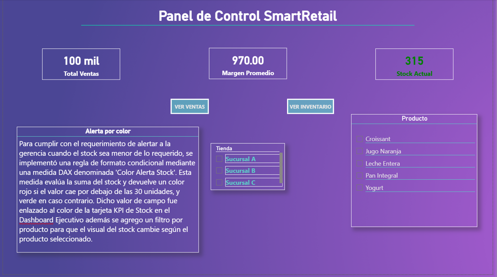
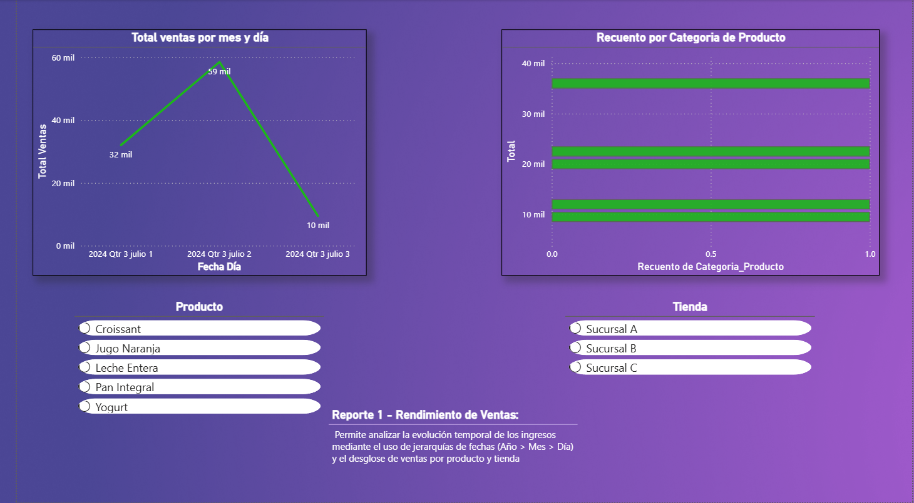
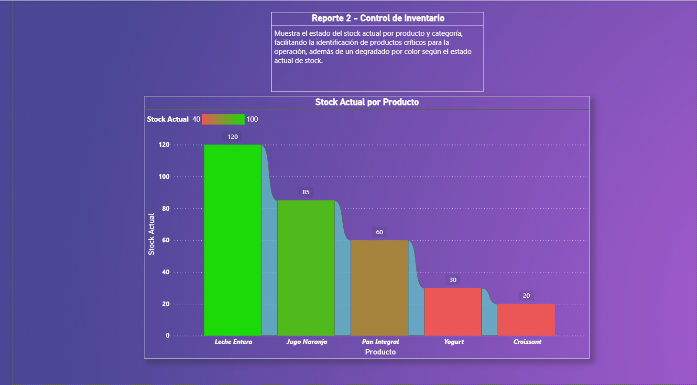

# 📊 Inteligencia de Negocios: Dashboard Ejecutivo Integral

## 🎯 Descripción del Proyecto

Este proyecto de Inteligencia de Negocios (BI) consiste en el diseño e implementación de un **Dashboard Ejecutivo Integral** desarrollado en Power BI. El objetivo principal es transformar datos transaccionales crudos en insights estratégicos accionables, permitiendo a la alta gerencia y a los líderes de área tomar decisiones basadas en datos de forma rápida y eficiente.

El reporte unifica tres vistas críticas del negocio: **Visión Ejecutiva Global**, **Análisis Profundo de Ventas** y **Control Estratégico de Inventario**.

---

## 🛠️ Tecnologías y Habilidades Aplicadas

* **Herramienta de BI:** Power BI Desktop.
* **ETL & Modelado:** Power Query (limpieza, transformación y normalización de datos).
* **Cálculos Avanzados:** DAX (creación de medidas complejas para KPIs, inteligencia de tiempo y ratios).
* **Visualización de Datos:** Diseño de interfaz de usuario (UI) intuitiva, storytelling con datos y selección de gráficos avanzados.

---

## 🖥️ Vistas del Dashboard y Análisis

### 1️⃣ Vista Ejecutiva (Executive Summary)

Esta vista proporciona una "foto instantánea" de la salud financiera y operativa de la empresa.

* **KPIs Principales:** Margen de Utilidad, Total de Ingresos, Número de Transacciones.
* **Análisis:** Distribución de ingresos por categoría de producto, evolución histórica de ventas y cumplimiento de objetivos.

### 2️⃣ Detalle de Ventas (Sales Deep Dive)

Un desglose detallado para entender el *cómo* y el *dónde* de los ingresos.

* **KPIs Principales:** Total Unidades Vendidas, Ingreso Promedio por Transacción.
* **Análisis:** Desempeño regional (mapas), ranking de productos estrella y segmentación de ventas por canal.

### 3️⃣ Control de Inventario (Inventory Management)

Vista crítica para la optimización de la cadena de suministro y capital de trabajo.

* **KPIs Principales:** Total Stock Disponible, Costo Total de Inventario, Índice de Rotación.
* **Análisis:** Identificación de productos con sobrestock o riesgo de quiebre, valorización del inventario por categoría.

---

## 📂 Estructura del Repositorio

| Archivo/Carpeta | Descripción |
| :--- | :--- |
| `Dashboard_ejecutivo.pbix` | Archivo fuente de Power BI con el modelo de datos y reportes. |
| `1.Dashboard_Ejecutivo.jpg` | Captura de pantalla de la Vista Ejecutiva. |
| `2.Dashboard_Ventas.jpg` | Captura de pantalla del Detalle de Ventas. |
| `3.Dashboard_Control_Inventario.jpg` | Captura de pantalla del Control de Inventario. |

---

## 🚀 Cómo Visualizar el Proyecto

Para interactuar con el modelo de datos y las visualizaciones avanzadas:

1.  Descarga e instala [Power BI Desktop](https://powerbi.microsoft.com/desktop/) (gratuito).
2.  Clona este repositorio o descarga el archivo `Dashboard_ejecutivo.pbix`.
3.  Abre el archivo `.pbix` con Power BI Desktop.

---

## 👤 Autor

**Javier Orellana Santander**
* Ingeniero en Informática | Analista TI & Desarrollador
* 📧 Email: [javier.orellana2001@gmail.com](mailto:javier.orellana2001@gmail.com)
* 💼 LinkedIn: [linkedin.com/in/javier-ignacio-orellana-santander](https://www.linkedin.com/in/javier-ignacio-orellana-santander)
* 🖥️ GitHub: [github.com/Javierilox](https://github.com/Javierilox)

---
⭐️ Si te gustó este proyecto, ¡no olvides darle una estrella al repositorio!
